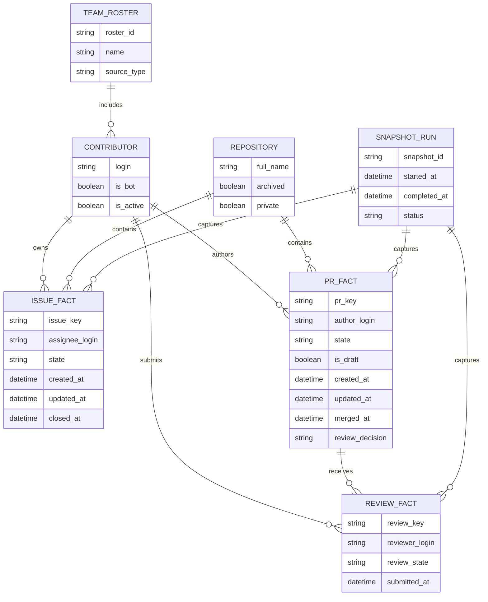

# feat: Add zephyrproject-rtos team activity dashboard

## Overview
## Team Member Source

The team roster is sourced from [upstream_member.csv](upstream_member.csv), which contains GitHub logins, names, and roles. This file is updated periodically and serves as the authoritative list for dashboard metrics and filtering. The dashboard must support dynamic updates as the CSV changes, ensuring all metrics reflect the latest roster.

Build a dashboard that shows activity for a defined team roster across the `zephyrproject-rtos` GitHub organization for a user-selected period.

The dashboard should answer:
- How many GitHub issues are currently assigned to the team?
- What is the current PR situation for the team?
- Which PRs were reviewed by the team?
- What other activity signals help explain team workload, responsiveness, and collaboration?

The initial target is a **quick internal dashboard** with a **hybrid refresh model**:
- scheduled snapshots for period reporting and trends
- selective live refresh for high-volatility views such as open assigned issues and open review queue

## Problem Statement / Motivation

GitHub exposes many useful signals, but they are fragmented across issues, pull requests, reviews, comments, and repository activity. Team leads and managers need a simple way to understand the current workload and recent activity for a known list of GitHub accounts without manually running multiple searches.

For `zephyrproject-rtos`, the main need is descriptive analytics rather than performance scoring:
- visualize current assigned work
- understand PR flow and review load
- identify stale or blocked work
- see which repositories and contributors are most active during a selected time window

## Proposed Solution

Create an internal dashboard centered on a **team roster** and a **date range selector**.

### Primary dashboard sections

1. **Assigned issues**
   - open issues currently assigned to team members
   - issues created in the period and assigned to team members
   - issues closed in the period with a team member as assignee
   - per-user and per-repository breakdown

2. **PR situation**
   - open authored PRs
   - merged PRs in the period
   - closed-unmerged PRs in the period
   - draft vs ready-for-review split
   - open PRs awaiting review
   - PRs with `changes requested`
   - stale open PRs by inactivity threshold

3. **PRs reviewed by the team**
   - unique PRs reviewed by each team member in the period
   - review outcomes: `approved`, `changes requested`, `commented`
   - currently pending review requests for the team
   - review load distribution across contributors

4. **Suggested additional activity views**
   - review responsiveness: median / p75 time to first review
   - PR throughput: median / p75 time from PR open to merge
   - comment activity on issues and PRs
   - repository distribution: which repos the team touched most
   - contribution breadth: number of repos touched per contributor
   - stale assigned issues and stale review requests
   - PRs without team review
   - open PRs with failing checks

### Recommended product boundaries for v1

Include:
- GitHub activity for a supplied list of usernames
- repositories under `zephyrproject-rtos`
- summary cards, charts, filters, and drill-down tables
- CSV export for filtered detail views
- explicit partial-data warnings

Defer:
- blended “contribution score” or ranking
- non-GitHub sources
- webhook-heavy real-time processing
- cross-org analytics

## Technical Considerations

### Recommended architecture

Use a **snapshot-first, hybrid-refresh architecture**.

#### 1. Collection strategy

- **Scheduled collector** runs every 15 to 60 minutes and stores normalized snapshots for the configured roster.
- **Live refresh** is limited to current-state widgets, not full historical recomputation.
- **Drill-down details** are fetched lazily only when needed.

#### 2. GitHub data sources

**Use Search API for coarse aggregates and current-state widgets**
- best for open assigned issues, authored PR state counts, pending review queue, and stale work
- example query shapes:
  - `org:zephyrproject-rtos is:issue is:open assignee:LOGIN archived:false`
  - `org:zephyrproject-rtos is:pr author:LOGIN merged:START..END`
  - `org:zephyrproject-rtos is:pr review-requested:LOGIN is:open`
  - `org:zephyrproject-rtos is:pr reviewed-by:LOGIN updated:START..END`

**Use GraphQL and targeted REST calls for rich detail and event-accurate metrics**
- PR state and metadata
- reviews and review states
- assignees, labels, participants, comments, merge timestamps
- issue / PR timeline data when the metric depends on *when* an assignment or review happened

**Use snapshots for period reporting**
- historical charts should read from stored rollups rather than recompute everything on page load
- snapshotting is the safest way to support trends without overusing API quotas

#### 3. Identity and scope rules

- The supplied GitHub usernames are the source of truth for team inclusion.
- Deduplicate usernames before querying.
- Invalid, renamed, suspended, or inaccessible accounts must be surfaced in a warning area without breaking the rest of the dashboard.
- Bot accounts should be excluded by default or clearly labeled.
- Scope v1 to repositories inside `zephyrproject-rtos` only.

#### 4. UI structure

Recommended views:
- summary KPI row
- team member leaderboard table
- repo activity table
- trend charts by week / day
- filtered activity detail table
- warnings / sync health panel

Recommended filters:
- date range
- contributor
- repository
- activity type
- state (`open`, `merged`, `closed`, `draft`, `awaiting review`)

### Data model sketch

### Source-selection guidance

| Need | Preferred source | Notes |
| --- | --- | --- |
| Open assigned issue counts | Search API | Fast and simple for current-state queries |
| Authored PR state counts | Search API | Good for open, merged, draft, and stale PR rollups |
| Review queue | Search API | `review-requested:` is useful for current pending requests |
| Review event counts in a period | GraphQL / REST reviews | Needed for accurate “review submitted during period” reporting |
| Assignment events in a period | Issue / PR timeline APIs + snapshots | Search alone cannot reliably answer this |
| Historical charts | Snapshot store | Avoid expensive live recomputation |
| Drill-down item details | GraphQL first, REST as needed | Fetch only on demand |

### Known API constraints

- REST core requests have an hourly limit; Search has a stricter limit of roughly **30 authenticated requests per minute**.
- Search queries can time out and return `incomplete_results=true`.
- Search queries are limited in length and boolean operators, so large multi-user OR queries are a poor fit.
- Search results are capped, so org-wide queries over large windows may need per-user queries and date bucketing.
- GraphQL is better for nested PR details, but queries must remain paginated and shallow enough to manage resource cost.

## System-Wide Impact

- **Interaction graph**: dashboard filters trigger snapshot reads first; current-state widgets may then issue live GitHub queries; drill-down actions fetch item-level detail on demand.
- **Error propagation**: GitHub API failures, rate limits, or permission gaps must surface as partial-data states in the UI and in sync logs.
- **State lifecycle risks**: incomplete syncs can create misleading totals unless each snapshot is marked with status and freshness metadata.
- **API surface parity**: issue, PR, and review views must use consistent date-range and identity rules.
- **Integration test scenarios**: boundary timestamps, renamed users, invalid usernames, archived repos, incomplete search results, and permission-restricted repositories.

## Acceptance Criteria

- [ ] Users can configure a roster of GitHub usernames and save it as the team source of truth.
- [x] Users can select preset or custom date ranges and see the active timezone used for calculations.
- [x] The dashboard shows team-level and per-user counts for open assigned issues across `zephyrproject-rtos`.
- [x] The dashboard shows authored PR counts by state: open, draft, merged in period, and closed-unmerged in period.
- [x] The dashboard shows PR review activity per team member with review outcome breakdown.
- [x] The dashboard shows open review requests currently pending on team members.
- [x] The dashboard includes at least three additional signals: stale work, repository distribution, and review responsiveness.
- [x] Users can click a contributor row or use the contributor filter to update authored PR, reviewed PR, and issue detail tables for that contributor.
- [x] The reviewed PR table distinguishes `team-pr` from `ext-pr` based on whether the PR author is in the team roster.
- [x] The activity score formula is explained in the UI or supporting metric documentation.
- [ ] Summary view loads in 5 seconds or less for up to 50 users across a 90-day range on cached data.
- [ ] Drill-down detail loads in 2 seconds or less on cached data.
- [ ] Newly captured activity appears within 15 minutes of the most recent successful sync.
- [x] The UI always shows `last updated` and indicates when any data is partial or stale.
- [ ] Invalid or inaccessible usernames are listed explicitly and do not block valid results.
- [x] CSV export matches the currently filtered detail view.
- [x] If no qualifying activity exists, the dashboard shows a clear zero-state instead of an empty or broken layout.
- [x] Metric definitions are documented in-product or in supporting docs so stakeholders understand what each number means.

## Success Metrics

- Team leads can answer the three core questions without leaving the dashboard.
- Manual GitHub search effort for weekly team reporting is reduced significantly.
- At least 95% of common reporting use cases are satisfied from cached dashboard views without ad hoc API exploration.
- Validation checks against sampled GitHub source data show 100% correctness for the supported event types included in v1.

## Dependencies & Risks

### Dependencies

- GitHub authentication model and token storage
- access to relevant `zephyrproject-rtos` repository metadata
- a small persistence layer for snapshots and rollups
- charting and table components suitable for drill-down analytics

### Risks

- **Metric ambiguity**: “reviewed by team” and “assigned during period” must be defined by event timestamp, not inferred loosely.
- **Rate limits**: org-wide queries can exceed Search or GraphQL quotas if every dashboard load recomputes data.
- **Incomplete search results**: Search can return partial results for expensive queries.
- **Identity drift**: renamed or duplicate users can skew results unless normalized.
- **Interpretation risk**: the dashboard may be misused as a productivity scorecard unless wording and caveats are explicit.

## Implementation Suggestions

### Suggested file / module breakdown

- `app/team_rosters/*` — roster definition and validation
- `app/github_sync/*` — collectors, pagination, retries, and normalization
- `app/analytics/*` — metric definitions and rollups
- `app/dashboard/*` — filters, cards, charts, and detail tables
- `app/exports/*` — CSV export logic
- `docs/metrics/team-activity-metrics.md` — metric definitions and caveats

### Suggested delivery phases

1. **Foundation**
   - define roster model
   - define metric glossary
   - implement snapshot pipeline for issues / PRs / reviews

2. **Core dashboard**
   - build summary cards and per-user table
   - add date filters and repository filters
   - add current-state review queue and stale work widgets

3. **Validation and polish**
   - add partial-data warnings
   - add CSV export
   - validate counts against sampled GitHub searches and item pages

## Sources & References

### Internal references

- `.github/skills/ce-plan/SKILL.md` — planning workflow and naming conventions
- `.github/copilot-mcp-config.json` — external docs access is configured
- No `CLAUDE.md`, `docs/brainstorms/`, or `docs/solutions/` documents were found in this workspace at planning time.

### External references

- GitHub search qualifiers for issues and pull requests: https://docs.github.com/en/search-github/searching-on-github/searching-issues-and-pull-requests
- GitHub REST Search API: https://docs.github.com/en/rest/search/search#search-issues-and-pull-requests
- GitHub REST rate limits: https://docs.github.com/en/rest/using-the-rest-api/rate-limits-for-the-rest-api
- GitHub REST pull request reviews: https://docs.github.com/en/rest/pulls/reviews
- GitHub GraphQL guide for reducing multiple REST calls into nested PR queries: https://docs.github.com/en/graphql/guides/migrating-from-rest-to-graphql
- GitHub GraphQL pagination guidance: https://docs.github.com/en/graphql/guides/using-pagination-in-the-graphql-api

### Planning notes carried forward from research

- Prefer Search for current-state counts and narrow rollups.
- Prefer GraphQL / targeted REST for accurate review and assignment event data.
- Use scheduled snapshots for reliable historical reporting.
- Keep v1 descriptive and avoid a single blended contribution score.
